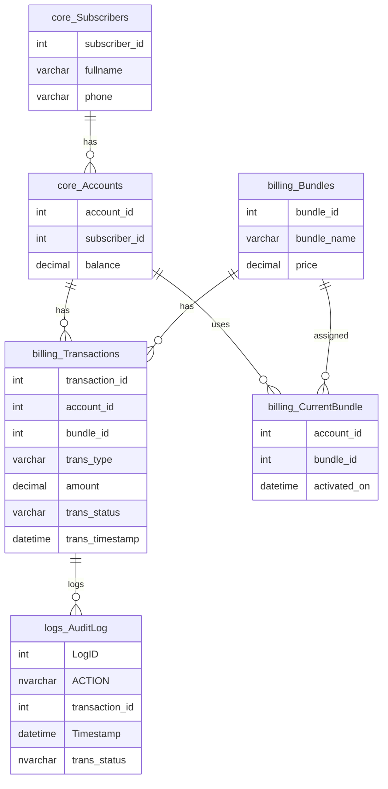

<h1>Telco-ACIDShield</h1>

# Telecom Billing System (SQL-based)

This project demonstrates a simplified telecom billing system using SQL Server.  
It highlights how to implement **ACID-compliant transactions** in stored procedures, particularly focusing on a **Subscribe to Bundle** scenario.

---

📄 [View the full ACID Demo PDF](./Telco_ACIDSheild.pdf)

---
## Features

- ACID properties implemented and enforced (Atomicity, Consistency, Isolation, Durability)
- Modular schema with clear separation of:
  - `core` (Accounts, Subscribers)
  - `billing` (Bundles, Transactions, CurrentBundle)
  - `logs` (AuditLog)
- Safe stored procedure: `SubscribeToBundle`
- Handles business rules:
  - Valid accounts and bundles
  - Sufficient balance
  - Replacing old subscriptions
  - Error handling with rollback

---

## Tech Stack

- Microsoft SQL Server
- T-SQL (Stored Procedures, Transactions)
- Schema-first design

## Entity Relationship Diagram (ERD)

  

